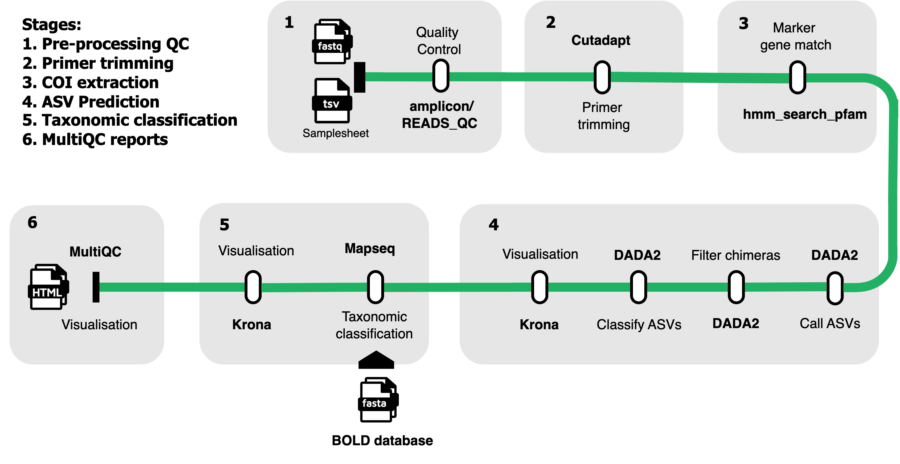

[](https://www.nextflow.io/)
[](https://github.com/nf-core/tools/releases/tag/3.3.1)
[](https://docs.conda.io/en/latest/)
[](https://www.docker.com/)
[](https://sylabs.io/docs/)

# EBI-Metagenomics eDNA Analysis Pipeline

This repository contains the v1.0 EBI-Metagenomics eDNA analysis pipeline. This pipeline is designed for the analysis of environmental DNA (eDNA) sequencing data, implementing a comprehensive workflow for quality control, primer identification, taxonomic profiling, and Amplicon Sequence Variant (ASV) calling using modern bioinformatics tools.

## Pipeline Description

<h1>
  <picture>
    <source media="(prefers-color-scheme: dark)" srcset="docs/images/edna_schema.png">
    
  </picture>
</h1>


### Features

The eDNA analysis pipeline v1.0 implements the following key features:

**Quality Control and Preprocessing:**
- Raw reads quality assessment using FastQC
- Reads quality control and filtering using fastp
- Automatic read merging for single-end analysis
- Minimum read count filtering (configurable threshold)

**Primer Analysis:**
- Automatic primer identification using PIMENTO
- Primer trimming using Cutadapt
- Primer validation and reporting

**Taxonomic Profiling:**
- Pfam-based COI (Cytochrome c Oxidase subunit I) profiling using HMMER
- Reads percentage threshold filtering for quality control
- Profile-based taxonomic classification

**ASV Analysis:**
- Amplicon Sequence Variant (ASV) calling using DADA2
- ASV taxonomic classification using MAPseq
- Krona chart visualization for taxonomic results

**Reporting and Quality Control:**
- Comprehensive MultiQC reports
- Failed and passed runs tracking
- Software version reporting

## Tools

| Tool | Version | Purpose |
|------|---------|---------|
| [fastp](https://github.com/OpenGene/fastp)  | 0.24.0 | Read quality control and filtering |
| [PIMENTO](https://github.com/EBI-Metagenomics/PIMENTO)  | 1.0.2 | Primer identification and inference |
| [cutadapt](https://cutadapt.readthedocs.io/en/stable/)  | 4.6 | Primer trimming |
| [HMMER](http://hmmer.org/) | 3.4 | Profile HMM searching for COI sequences |
| [DADA2](https://benjjneb.github.io/dada2/index.html)   | 1.30.0 | ASV calling and denoising |
| [MAPseq](https://github.com/meringlab/MAPseq)  | 2.1.1 | Taxonomic classification of ASVs |
| [Krona](https://github.com/marbl/Krona)  | 2.8.1 | Interactive taxonomic visualization |
| [MultiQC](https://github.com/MultiQC/MultiQC) | 1.27 | Aggregated quality control reporting |
| [mgnify-pipelines-toolkit](https://github.com/EBI-Metagenomics/mgnify-pipelines-toolkit) | 1.0.4 | Toolkit containing various in-house processing scripts |

## Reference Databases

This pipeline uses the following reference databases:

| Database | Purpose | Default Location |
|----------|---------|------------------|
| BOLD | COI taxonomic classification and popular COI primers | Configurable via parameters |

> [!NOTE]
> Database paths can be configured in the pipeline parameters. Contact the development team for access to preprocessed databases.

## How to Run

### Requirements

The pipeline requires:
- Nextflow (≥24.04.2)
- Docker, Singularity, or Conda for software management
- Access to reference databases

### Input Format

The input data should be eDNA sequencing reads (paired-end or single-end) in FASTQ format, specified using a CSV samplesheet:

```csv
sample,fastq_1,fastq_2,single_end
sample1,/path/to/sample1_R1.fastq.gz,/path/to/sample1_R2.fastq.gz,false
sample2,/path/to/sample2.fastq.gz,,true
```

### Basic execution

```bash
nextflow run EBI-Metagenomics/edna \
    -r main \
    -profile codon_slurm \
    --input samplesheet.csv \
    --outdir results
```

### Key Parameters

| **Parameter** | **Default** | **Description** |
|----------------|-------------|-----------------|
| `--min_read_count` | `5000` | Minimum number of reads required per sample |
| `--reads_percentage_threshold` | `0.80` | Minimum percentage of reads matching COI profile |
| `--std_primer_library` | `[]` | Custom primer library for PIMENTO |
| `--pfam_coi_db` | `Default path` | Path to Pfam COI HMM database |


## Outputs

### Output directory structure

Example output structure for a sample (sample1):
```bash
results/
├── sample1/
│   ├── fastqc/
│   │   ├── sample1_raw_fastqc.html
│   │   └── sample1_clean_fastqc.html
│   ├── primer_identification/
│   │   ├── sample1_primers.fasta
│   │   └── sample1_primer_validation.tsv
│   ├── quality_control/
│   │   ├── sample1.fastp.json
│   │   └── sample1_merged.fastq.gz
│   ├── taxonomic_profiling/
│   │   ├── sample1_pfam_profile.tsv
│   │   └── sample1_coi_hits.domtbl
│   ├── asv_analysis/
│   │   ├── sample1_asv_seqs.fasta
│   │   ├── sample1_asv_counts.tsv
│   │   └── sample1_dada2_stats.tsv
│   └── taxonomic_classification/
│       ├── sample1_mapseq_taxonomy.tsv
│       └── sample1_krona.html
├── pipeline_info/
│   ├── execution_report_YYYY-MM-DD_HH-mm-ss.html
│   ├── execution_timeline_YYYY-MM-DD_HH-mm-ss.html
│   ├── execution_trace_YYYY-MM-DD_HH-mm-ss.txt
│   ├── pipeline_dag_YYYY-MM-DD_HH-mm-ss.html
│   └── edna_software_mqc_versions.yml
├── multiqc_report.html
├── qc_passed_runs.csv
└── qc_failed_runs.csv
```

### Key Output Files

* **MultiQC Report**: Comprehensive quality control summary across all samples
* **ASV Sequences**: FASTA files containing called Amplicon Sequence Variants
* **Taxonomic Classifications**: TSV files with taxonomic assignments for ASVs
* **Krona Charts**: Interactive HTML visualizations of taxonomic composition
* **QC Summary Files**: Lists of samples that passed or failed quality control steps

### Configuration Profiles

The pipeline includes several pre-configured profiles:

* docker: Use Docker containers
* singularity: Use Singularity containers
* conda: Use Conda environments
* codon_slurm: Optimized for SLURM clusters
* test: Small test dataset for validation

## Citations

This pipeline uses code developed and maintained by the [nf-core](https://nf-co.re) community, reused here under the [MIT license](https://github.com/nf-core/tools/blob/master/LICENSE).

> **The nf-core framework for community-curated bioinformatics pipelines.**
>
> Philip Ewels, Alexander Peltzer, Sven Fillinger, Harshil Patel, Johannes Alneberg, Andreas Wilm, Maxime Ulysse Garcia, Paolo Di Tommaso & Sven Nahnsen.
>
> _Nat Biotechnol._ 2020 Feb 13. doi: [10.1038/s41587-020-0439-x](https://dx.doi.org/10.1038/s41587-020-0439-x).
